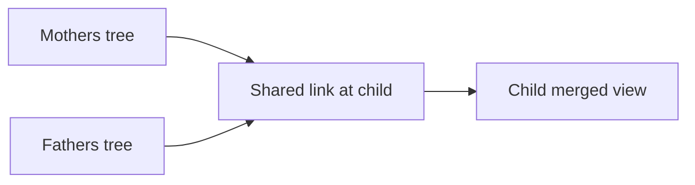

# Collaboration v2: Linked Trees (Option B)

This document describes the deferred **linked trees** approach for honoring multiple family heritages when different relatives maintain separate archives. Phase 1 shipped **dual roots in one tree** (Option A); this is the roadmap for cross-account collaboration.

## Problem

Option A works when one person builds both sides in a single tree. It does not solve:

- Mom maintains her Mexican line in her account
- Dad maintains his German line in his account
- The child wants a merged read-only view without re-entering everything

## Proposed model

Each user owns one tree (current v1 design). Trees can be **linked** at shared members — typically the child (anchor) and optionally shared grandparents in blended families.



## Schema sketch

```sql
-- Link two member records across trees
create table public.tree_links (
  id uuid primary key default gen_random_uuid(),
  tree_a_id uuid not null references public.trees(id) on delete cascade,
  tree_b_id uuid not null references public.trees(id) on delete cascade,
  member_a_id text not null,
  member_b_id text not null,
  relationship text not null default 'same_person',
  created_by uuid references auth.users(id),
  created_at timestamptz not null default now(),
  unique (tree_a_id, member_a_id, tree_b_id, member_b_id)
);

-- Invite relatives as viewers or editors on a branch
create table public.tree_memberships (
  id uuid primary key default gen_random_uuid(),
  tree_id uuid not null references public.trees(id) on delete cascade,
  user_id uuid not null references auth.users(id) on delete cascade,
  role text not null check (role in ('viewer', 'editor')),
  branch_root_member_id text,
  created_at timestamptz not null default now(),
  unique (tree_id, user_id)
);
```

Member IDs remain in each tree's `members.data` JSONB; links reference those IDs per tree.

## Merged view (virtual)

The child’s merged view is **computed**, not stored:

1. Load both trees via authorized links
2. Walk from each link point outward (ancestors on each side)
3. Deduplicate at link nodes (same person = one card)
4. Render using the existing `dualRoots` layout with `anchorMemberId` at the junction

Reuse `buildHeritageMap` from `src/lib/heritageUtils.ts` — maternal/paternal assignment already traces from anchor parents.

## Auth and RLS

- Tree owner can create links; linked tree owner must accept
- Viewers see read-only merged data; editors can propose changes on their branch
- RLS policies on `tree_links` and `tree_memberships` scoped to participating users

## Conflict resolution (later)

- Same person edited in both trees: last-write-wins per field, or explicit merge UI
- Contradictory parent links: flag for manual review

## Migration from Option A

Users who already built both sides in one tree keep working unchanged. When Collaboration v2 ships:

- **Import/link** another tree at the anchor member instead of re-entering a branch
- `heritage_mode` and `anchor_member_id` in `user_preferences` become the junction config for merged views

## Why deferred

- Requires multi-account auth flows, invitations, merge logic, and RLS — large lift vs. Phase 1
- Most bicultural users are the sole builder initially; one tree with dual roots covers the common case
- Phase 1 fields (`heritageSide`, `heritageLabel`, `anchorMemberId`) are designed so Option B attaches without breaking existing data

## Related files

- `src/lib/heritageUtils.ts` — heritage side computation (reused in merge)
- `src/components/TreeCanvas.tsx` — `dualRoots` layout
- `supabase/migrations/20260531130000_heritage_preferences.sql` — anchor + heritage_mode prefs
